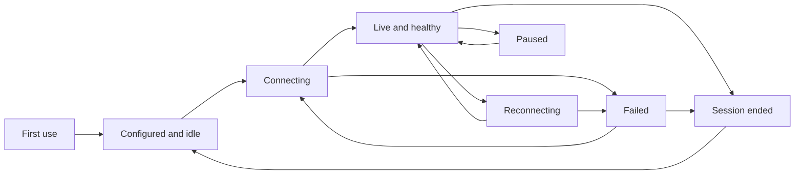
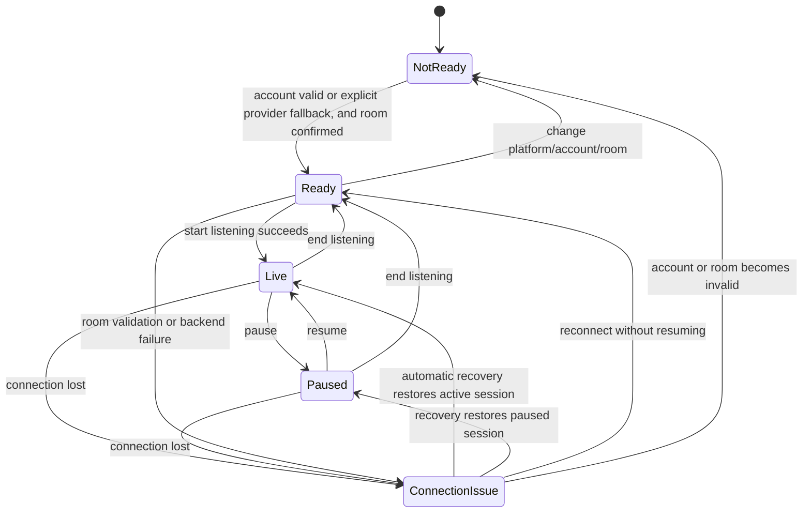

# NEKO Live UI / UX Research Log

Date: 2026-07-13  
Scope: `plugin/plugins/neko_roast` only  
Audience: product, UI, runtime, privacy, and test maintainers

This document records confirmed product and UX problems before the UI refactor. It separates code-backed facts from product recommendations so that later implementation does not silently change runtime behavior.

## Product principles

1. The default screen is for a first-time streamer, not for a plugin developer.
2. Controls describe user intent and observable behavior, not internal module topology.
3. A toggle is appropriate only for a clear, immediate binary state. Diagnostics and pipeline stages should normally be status, not switches.
4. Safe defaults should let the plugin work without requiring the user to understand `dry-run`, queues, pipelines, prompt injection, or module IDs.
5. Persistent viewer memory is a separate product capability from session safety and deduplication. The UI must not present them as one vague “viewer profile” feature.
6. Local-only storage is safer than remote storage, but it still needs purpose, retention, visibility, and deletion controls.

## Confirmed issue ledger

| ID | Severity | Confirmed problem | Code evidence | Recommended direction |
| --- | --- | --- | --- | --- |
| UI-001 | High | The first-appearance roast card owns a `live_enabled` switch even though that flag controls the whole live listener and live runtime, not only avatar roast. Turning it off can stop all live interaction. | `ui/panel.tsx`; `core/runtime_live_controls.py` | Keep one primary “启动 NEKO” control in the connection area. Give first-appearance roast its own behavior setting only if the runtime has a dedicated flag. |
| UI-002 | Medium | Connection and runtime actions are distributed across “connect”, module cards, pause/resume, and advanced settings. The user must infer which control is authoritative. | `ui/panel.tsx`; `core/runtime_live_controls.py` | Use one stateful primary action: start, starting, running, reconnecting, failed. Show only the action valid for the current state. |
| UI-003 | Medium | Long-running actions do not consistently expose a pending/disabled state, so repeated clicks can look harmless while starting duplicate work or producing confusing feedback. | `ui/panel.tsx` action handlers | Add per-action pending state and idempotent button behavior. |
| UI-004 | High | Interaction cards mirror engineering modules. This encourages a generic “one switch per module” design, but several modules are infrastructure or routing stages rather than optional user features. | `core/runtime_modules.py`; `modules/*`; `ui/panel.tsx` | Group by user goal: live replies, first-appearance roast, paid-support acknowledgement, automatic hosting, safety. Show pipeline health separately. |
| UI-005 | Medium | “触发开场接待” and “触发主动营业” are real-output developer/test actions but sit beside normal live behavior cards. | `ui/panel.tsx`; hosted actions in `__init__.py` | Move manual triggers into developer tools and label that they may produce real output. |
| UI-006 | Low | “活跃度” is ambiguous to beginners: it can sound like viewer activity instead of NEKO's speaking frequency. | `activity_level` config and panel copy | Rename the user-facing concept to “说话频率”; keep the internal config key for compatibility. |
| UI-007 | Medium | `dry-run` is an engineering term and was exposed as a normal advanced toggle. A beginner cannot predict whether NEKO will actually speak. | `ui/panel.tsx`; `dry_run` config | Remove it from the normal live flow. Keep a developer-only “测试模式（不会发送给 NEKO）” control if the capability remains. Default remains off. |
| MEM-001 | High | Rich cross-session viewer memory is written automatically for normal live danmaku. There is no dedicated `viewer_memory_enabled` user preference. | `core/pipeline_viewers.py`; `modules/viewer_profile/__init__.py`; `stores/viewer_store.py` | Split session context from persistent familiar-viewer memory. Add an explicit plain-language persistent-memory setting. |
| MEM-002 | High | The profile contains stable UID, nickname, avatar URL, first/last seen times, roast/output history, danmaku count, inferred interests, interaction style, response preference, summary, and avoid guidance. Raw danmaku text is intentionally not stored, which is good, but the remaining fields still form a persistent behavioral profile. | `core/contracts_viewer.py`; `stores/viewer_store.py`; `core/viewer_preferences.py` | Explain exactly what is stored. Minimize persisted identity fields; do not persist avatar URL or latest output unless a demonstrated feature needs them. Consider a stable local pseudonymous key instead of displaying raw UID by default. |
| MEM-003 | High | Normal UI shows viewer profiles but intentionally exposes no clear, delete, or reset controls. Those operations exist only as developer-gated plugin entries. A streamer can see that memory exists but cannot manage it in the same UI. | `ui/panel_data_sections.tsx`; `tests/test_smoke.py`; `__init__.py`; `core/runtime_live_controls.py` | Add ordinary, guarded controls for “清除全部熟客记忆” and per-viewer “删除记忆”. Keep test-only first-roast reset in developer tools. |
| MEM-004 | High | There is no retention/expiry policy. Profiles remain in `viewer_profiles.json` until a developer action removes them. Freshness lowers prompt trust but does not delete data. | `stores/viewer_store.py`; `core/viewer_preferences.py` | Add a documented retention policy and automatic pruning, for example 90 days since last interaction, configurable only in advanced privacy settings if needed. |
| MEM-005 | High | “本场防重复” and “跨场记住观众” share the same profile path. `PipelineSessionTracker` already has session-local roast state, while `roast_once_per_uid` also queries persistent `roast_count`. | `core/pipeline_session.py`; `stores/viewer_store.py`; `core/pipeline_flow.py` | Keep session deduplication always on and invisible. Separate the explicit cross-session setting “记住已做过出场锐评的观众” from rich preference memory. |
| MEM-006 | Medium | The stored inference can be wrong. Confidence, freshness, stable-count thresholds, and “current danmaku first” prompt rules reduce harm, but users cannot correct a bad profile without entering developer mode. | `core/viewer_preferences.py`; `stores/viewer_store.py`; `ui/panel_data_sections.tsx` | Provide deletion/reset where the profile is displayed. Avoid editable inferred labels in v1; deletion is simpler and safer than manual profile editing. |
| MEM-007 | Medium | The data page exposes raw UID and detailed inferred preferences in a wide engineering table. It is useful for debugging but visually reads as a primary product feature. | `ui/panel_data_sections.tsx` | In the normal UI, show a compact “熟客记忆” summary and count. Put the detailed table, confidence, freshness, raw UID, and derived tags under diagnostics/privacy details. |
| MEM-008 | Medium | Reset semantics are technically careful but product language is unclear: “reset impression” clears inferred preferences while preserving first-roast history, danmaku count, nickname/avatar, and output history. | `stores/viewer_store.py::reset_profile_impression`; `tests/test_viewer_store_clear.py` | Rename to “清除偏好记忆” and state what remains. Offer full deletion as a separate action. |
| MEM-009 | Low | Storage fallback is robust for ordinary writes, while destructive operations deliberately fail closed instead of clearing only a fallback copy. This is correct but too complex for a beginner-facing storage card. | `stores/viewer_store.py`; `tests/test_viewer_store_clear.py` | Normal UI should say only “观众记忆保存在本机” plus health. Show path/fallback details under diagnostics. |
| SAF-001 | High | The UI calls the safety counter a “queue” and offers “清空队列”, but `SafetyGuard` has no cancellable backlog. `queue_size` is an in-flight capacity counter and `clear_queue()` only sets that number to zero; already running work is not cancelled. | `core/safety_guard.py`; `core/runtime_live_controls.py`; `ui/panel.tsx` | Remove “清空队列” from the normal UI. Rename the diagnostic to “处理中 / 并发上限”. If real cancellation is needed later, implement it as a different capability. |
| SAF-002 | High | Pause and resume are displayed at the same time even though only one is valid. Resume also clears failure buckets, overflow state, cooldown timestamps, and the safety counter, so it is more than a simple inverse of pause. | `ui/panel.tsx`; `core/safety_guard.py` | Show “暂停 NEKO” only while running. When manually paused, show “继续运行”; when auto-stopped, show “检查后恢复”, with a concise explanation that safety state will reset. |
| SAF-003 | High | “自动急停” is a protective default but is editable like an ordinary preference. A novice can disable a safety boundary without understanding queue overflow or repeated output failures. | `ui/panel.tsx`; `core/safety_guard_failures.py`; `RoastConfig.safety_auto_stop_enabled` | Keep automatic stop on in normal mode and show it as protection status. Allow disabling only in developer tools with an explicit warning, if the capability must remain. |
| SAF-004 | Medium | “冷却秒数” and “队列上限” expose raw implementation tuning next to the safer behavior-level `activity_level`. Users can create contradictory pacing expectations. | `ui/panel.tsx`; `core/contracts_config.py`; `core/safety_guard_cooldown.py` | Let “说话频率” own normal pacing. Move exact cooldown and concurrency limits to developer/diagnostic settings. |
| SAF-005 | Medium | Safety state labels such as “降级中” and “已熔断” are engineering language. They do not tell the streamer whether NEKO will speak, why it stopped, or what action is safe. | `i18n/zh-CN.json`; `ui/panel.tsx`; `core/safety_guard.py` | Normal status should answer: “可正常回复”, “已暂停”, “已自动停止，需要检查”, or “直播间未连接”. Keep `degraded`/`tripped` as diagnostic codes. |
| SAF-006 | Medium | The same safety state is repeated in the live overview and advanced cards without adding a recovery path. | `ui/panel.tsx` | Keep one prominent live-health banner with reason and next action; put counters and raw state under diagnostics. |

## Deep research pass: onboarding, information architecture, diagnostics, and accessibility

This pass used three independent read-only audits. It did not run the Hosted UI or capture screenshots. Findings about state transitions, DOM semantics, column counts, and CSS overflow are code-backed; exact visual hierarchy, contrast ratios, focus order, and the amount of clipping still require a rendered audit.

### First use and connection recovery

| ID | Severity | Confirmed problem | Code evidence | Recommended direction |
| --- | --- | --- | --- | --- |
| ONB-001 | High | The first task is buried. Platform/authentication is followed by four stream-context fields, a large live-state diagnostic block, and solo-test readiness before the room field and start action appear. | `ui/panel.tsx:576-805` | Put room selection and one primary “启动 NEKO” action at the top. Defer stream context and test readiness until after a room is connected. |
| ONB-002 | High | A successful room lookup remains visible after the room input is edited. The user can see verification for room A and then start room B because input changes do not invalidate `liveRoomResult`. | `ui/panel.tsx:228-245`; `ui/panel.tsx:750-772` | Clear lookup results whenever the room value changes. Bind the result to the exact normalized room reference and require a fresh lookup when it differs. |
| ONB-003 | High | Switching platform immediately persists `live_enabled=false`. During a running session this stops the current listener, but the select presents the change as an ordinary preference with no warning or pending state. | `ui/panel.tsx:217-225`; `core/runtime_config.py`; `core/runtime_live_listener.py` | Lock platform/room while running, or confirm that switching will stop the current connection. Finish the new platform setup before offering start. |
| ONB-004 | High | `auto_start=false` is explicit in the manifest, while the beginner quickstart starts with opening the plugin detail and panel and never explains the plugin-start prerequisite. Project plugin documentation and this plugin's developer guide both say manual start is required. An unused in-panel guide string even says no extra startup is needed. | `plugin.toml:78`; `docs/quickstart.md`; `docs/developer-guide.md:67`; repository `docs/zh-CN/plugins/plugin-toml.md`; `i18n/zh-CN.json:535-536` | Verify the packaged host screen. Either make the plugin genuinely auto-start, or make “启动 NEKO Live 插件” the explicit first step and first recovery action. |
| ONB-005 | High | The panel polls every three seconds but swallows refresh failures. A previously green state can remain visible with no “stale” timestamp or loss-of-contact message. | `ui/panel.tsx:137-153` | After a short silent retry window, show “状态可能已过期” with the last successful refresh time. Remove it automatically on recovery. |
| ONB-006 | Medium | Authentication status fetch failures are swallowed and collapse into normal empty/not-logged-in presentation. Users cannot distinguish missing credentials from a failed status check. | `ui/panel.tsx:381-394`; `ui/panel_components.tsx:184-199` | Model authentication as loading, logged in, logged out, and check failed. Give each failure one safe next action. |
| ONB-007 | Medium | Most failures surface the raw backend `err.message` in a transient toast. They do not classify retryable connection failures, credential errors, invalid room input, or internal faults. | `ui/panel.tsx:208-214,227-403` | Use actionable user messages in the main flow and put raw errors/codes in expandable diagnostics. |
| ONB-008 | High | Automatic reconnect is projected as “not started”. The UI only treats connected/receiving as started, so reconnecting reopens Lookup/Start even while both providers are already trying to recover. | `ui/panel.tsx:566-572,775-805`; `modules/bili_live_ingest/danmaku_core.py`; `modules/live_bridge/transport.py` | Treat connecting, authenticating, and reconnecting as an in-progress running state. Disable Start, show attempt/progress, and offer only a secondary Cancel action. |
| ONB-009 | High | Platform target clearing is asymmetric. The UI clears room fields locally but saves only platform and live-enabled. Backend normalization clears the old target when switching to Douyin, not when switching back to Bilibili, so an old Douyin room reference can return after refresh. | `ui/panel.tsx:217-225`; `core/runtime_config.py:141-157`; `core/contracts_config.py:93-102` | Save platform, empty room reference, zero legacy room ID, and disabled state atomically for every platform switch, or keep separate remembered targets per platform. Add both switch-direction tests. |
| ONB-010 | High | Bilibili's provider state, runtime connection state, and Safety Guard are not driven by one state machine. Provider states such as authenticating are filtered out of the public projection, and later reconnect exhaustion does not clearly resynchronize runtime/safety state. | `core/runtime_live_controls.py:82-98`; `core/runtime_live_listener.py:70-80`; `modules/bili_live_ingest/__init__.py`; `modules/bili_live_ingest/danmaku_core.py` | Establish one provider-to-runtime connection state machine and derive UI, live status, and safety permission from it. Add transition tests before relying on the displayed health state. |
| ONB-011 | Medium | Deleting Bilibili credentials or a Douyin cookie does not stop/restart an already running listener that captured the old credential. The UI presents deletion as complete without explaining current-session behavior. | `core/runtime_bili_auth.py`; `core/runtime_douyin_auth.py`; provider listener startup code | If the affected provider is active, default to “停止连接并删除”. Explain that local credential deletion and platform-session revocation are different. |
| ONB-012 | Medium | Bilibili QR login requires manual “检查登录”, has no visible expiry countdown, and does not automatically progress through waiting/scanned/confirming. | `ui/panel_components.tsx:194-206`; `adapters/bili_auth_service.py:76,102-170` | Poll automatically while the QR session is active, show the current step and expiry, and turn the expired state into a clear Refresh action. |
| ONB-013 | Medium | The experimental Douyin path exposes raw Cookie, UID, nickname, and four credential buttons at the same level as the stable Bilibili path. | `ui/panel.tsx:578-629`; `i18n/zh-CN.json:497` | Mark it experimental and use a guided one-pass setup. Move status, validation, and deletion into credential details. |

### Settings and information architecture

| ID | Severity | Confirmed problem | Code evidence | Recommended direction |
| --- | --- | --- | --- | --- |
| IA-001 | High | The “强度” control sits inside the first-appearance roast card, but `roast_strength` also affects ordinary danmaku replies, paid-support acknowledgements, warmup hosting, and active engagement. | `ui/panel.tsx:973-1000`; `modules/avatar_roast`; `modules/danmaku_response`; `modules/live_support_events`; `modules/warmup_hosting`; `modules/active_engagement` | Move it to normal settings as “吐槽力度” or “说话风格” and say it affects all live replies. |
| IA-002 | High | The “观众” page mixes pipeline chains, timeline, trace ID, recent execution results, and persistent viewer profiles. It is neither a focused viewer-data page nor a coherent diagnostic page. | `ui/panel.tsx:1197-1217`; `ui/panel_data_sections.tsx:24-169` | Split into “隐私与观众数据” and “诊断”. Keep trace, route, latency, chain, timeline, and result status out of the normal viewer-data page. |
| IA-003 | High | Normal settings expose safety override and concurrency internals: automatic stop, exact cooldown, queue limit, dry-run, and a misleading clear-queue action. | `ui/panel.tsx:1134-1155`; `core/contracts_config.py` | Normal settings should expose behavior-level preferences only. Keep automatic protection on; move engineering overrides to developer tools and remove clear-queue. |
| IA-004 | Medium | The settings page also contains module health, audit rows, storage-path details, and developer-mode controls. These are diagnostics or development facilities rather than infrequently changed user preferences. | `ui/panel.tsx:1134-1194`; `ui/panel_components.tsx:254-270` | Make settings a short single-column preference page. Move module health, audit, paths, and counters to diagnostics. |
| IA-005 | Medium | Two primary tabs, “私信” and “自动化”, are always visible but contain only coming-soon placeholders. They compete with working live tasks and increase navigation cost. | `ui/panel.tsx:1221-1222,1337-1346` | Hide unreleased areas until they have a minimum complete flow. Do not reserve top-level navigation for roadmap placeholders. |
| IA-006 | Medium | Settings have inconsistent commit behavior: activity/mode changes save immediately, while theme and advanced fields require a generic Save button. The user cannot predict whether a change is live, pending, or persisted. | `ui/panel.tsx` config handlers and `saveConfig()` | Use immediate application for safe preferences and explicit Apply only for grouped/high-impact changes. Always expose saving/saved/failed state. |
| IA-007 | Medium | Developer mode can be toggled from both Settings and the developer page. Turning it off while on the developer page removes the current tab from the navigation. | `ui/panel.tsx:1190-1193,1240-1247,1345-1347` | Keep one developer-tools switch in Settings; do not let the current page remove itself without a controlled redirect. |
| IA-008 | Medium | The primary labels still describe the old “roast” slice. “开始/停止锐评” does not cover danmaku replies, support acknowledgements, and automatic hosting; “活跃度” does not clearly mean NEKO's speaking frequency. | `i18n/zh-CN.json`; `ui/panel.tsx:796-835` | Use “启动 NEKO / 停止直播互动 / 暂停发言” and “说话频率：少 / 适中 / 多”. |
| IA-009 | Low | Multiple generations of navigation and in-panel guide i18n keys remain, including `panel.tabs.guide`, while the current tab array has no guide page and the manifest separately registers markdown guides. | `i18n/*.json`; `ui/panel.tsx:1337-1347`; `plugin.toml` | After the IA is settled, remove confirmed-unused keys from all eight locales and keep manifest guides as the single documentation route. |

### Diagnostics, responsive layout, and accessibility

| ID | Severity | Confirmed problem | Code evidence | Recommended direction |
| --- | --- | --- | --- | --- |
| DIA-001 | High | Viewer profiles render 14 columns and recent results render 7 columns. The host table has no horizontal scroll wrapper; both table and card use overflow hiding, and the mobile rules only collapse grids. | `ui/panel_data_sections.tsx:106-165`; host `ui-kit/runtime.js:1136-1165`; host `ui-kit/styles.css:45-55,170-176,917-953` | Use a compact core-column list with details. On narrow widths render cards; short-term, add an explicit horizontal scroll area with a visible affordance. |
| DIA-002 | High | Real-output and state-changing actions have no pending/single-flight state. Repeated clicks can issue duplicate hosting output, connection, save, pause, or recovery requests. | `ui/panel.tsx:227-403,798-805,1077,1117` | Add per-action pending state, disable mutually exclusive controls, and show “连接中 / 正在保存 / 正在触发”. |
| DIA-003 | High | The first-appearance toggle has no label passed to `ToggleSwitch`; the component supplies an accessible name only when `label` is present. | `ui/panel_components.tsx:51-70`; `ui/panel.tsx:974-984` | Make an accessible label mandatory. Correct the broader product error that this control currently changes global `live_enabled`. |
| DIA-004 | High | Dynamic connection/safety state and operation feedback are not reliably announced to assistive technology. Host `Alert`, `StatusBadge`, and toast output lack status/alert live-region semantics. | host `ui-kit/runtime.js:948-973,1129,1171`; `ui/panel.tsx` | Add polite/assertive live regions in the host UI kit. Keep important connection and safety failures as persistent, focusable messages rather than toast-only feedback. |
| DIA-005 | Medium | Host tabs lack tablist/tab/tabpanel roles, selected state, controls linkage, and arrow-key behavior. The plugin currently has six or seven top-level tabs. | host `ui-kit/runtime.js:1842-1861`; `ui/panel.tsx:1335-1365` | Fix the host Tabs implementation to the ARIA tabs pattern before expanding plugin navigation. |
| DIA-006 | Medium | Long text such as reasons, paths, topics, and trace IDs is placed in fixed-size StatCards without robust wrapping, while cards hide overflow. | host `ui-kit/styles.css:45-55,138-140`; `ui/panel_data_sections.tsx:59-76`; `ui/panel.tsx:654-703,782-794` | Reserve StatCards for short metrics. Use wrapping key/value rows, code blocks, copy actions, and expandable technical details for long values. |
| DIA-007 | Medium | Empty arrays produce the same empty state whether data is truly empty, still loading, or failed to load. | `ui/panel_data_sections.tsx:106-169`; `ui/panel_components.tsx:254-270`; `ui/panel.tsx:1315-1329` | Add explicit loading/error/loaded-at state. Empty copy should explain what user action produces data. |
| DIA-008 | Medium | Status, safety, live phase, cooldown, and reasons repeat across the toolbar, console, room card, interaction cards, viewer/data page, and settings. | `ui/panel.tsx:654-705,748-840,1032-1118,1170-1217,1349-1365` | Keep one normal-mode health summary answering “能否发言 / 正在做什么 / 我该做什么”; move raw gates and counters to diagnostics. |
| DIA-009 | Low | In Douyin connection diagnostics, missing prerequisites are labelled with the generic “队列” string. | `ui/panel.tsx:782-786`; `i18n/zh-CN.json:14` | Label the field “缺少的条件” and translate safe machine codes into user actions. |

### Proposed five-area product structure

1. **直播** — connection health, room, the single valid primary action, mode, speaking frequency, and one concise recovery message.
2. **互动设置** — global tone/roast strength, first-appearance behavior, stream context, and future user-facing hosting preferences.
3. **隐私与观众数据** — familiar-viewer memory disclosure, local-storage health, retention, per-viewer deletion, and clear-all.
4. **诊断** — readiness, recent results, trace/chain/timeline, module health, audit, storage path, safety counters, and technical errors.
5. **开发者工具** — silent test/dry-run, simulated events, UID lookup, manual hosting output, exact cooldown/concurrency tuning, and safety overrides.

The first release of the refactor should not add new top-level areas for unreleased features. The primary navigation can be only **直播 / 互动设置 / 观众数据 / 诊断**, with developer tools appearing conditionally.

### Recommended implementation order

1. Fix behavior and truthfulness first: global switch ownership, stale room lookup, mutually exclusive actions, platform-switch confirmation, queue wording, and pending state.
2. Rebuild the first-use path: platform/authentication, room verification, one start action, one persistent health/recovery message.
3. Separate normal preferences, viewer privacy, diagnostics, and developer tools without changing runtime contracts.
4. Add missing memory controls and retention only after their product semantics are approved.
5. Perform a rendered narrow-width, keyboard, focus, screen-reader, and contrast audit before calling the UI refactor complete.

## Viewer memory: verified current behavior

### What is persisted

`viewer_profiles.json` currently stores:

- stable viewer UID, nickname, and avatar URL;
- first/last seen timestamps;
- first-appearance roast count, last roast time, and a short last output result;
- live danmaku count;
- inferred preference tags, favorite topics, recurring-joke cues, interaction style, reply preference, short impression, avoidance guidance, and last interaction time.

The persistence layer sanitizes values, bounds text length, redacts common credential-shaped strings, uses atomic file replacement, and serializes writes with an async lock.

### What is not persisted

- raw danmaku text;
- raw provider payloads;
- avatar bytes or base64 images;
- cookies, tokens, authorization headers, or provider credentials.

This is a meaningful privacy strength and should be communicated in plain language instead of being hidden in developer documentation.

### When memory changes output

The private viewer-memory prompt block is used by:

- first-appearance avatar roast;
- later danmaku replies;
- paid-support acknowledgement.

The prompt explicitly says current danmaku has priority, old memory is weak evidence, avatar impressions must not leak into normal replies, and stored data must not be announced to the viewer. These safeguards reduce misuse but do not replace user controls.

### First-appearance coupling

The runtime already has two distinct mechanisms:

1. session-local `_session_roasted_uids`, which prevents repeated first-appearance routing during the current run;
2. persisted `roast_count`, consulted when `roast_once_per_uid` is enabled, which prevents the same viewer from receiving another entrance roast after restart.

This proves the product can separate “safe operation this session” from “remember this person across sessions”; the UI and config should reflect that distinction.

## Recommended novice-facing model

### Normal live screen

- **启动 NEKO** — owns connection and live listener state.
- **直播回复** — always part of the product; no toggle.
- **首次出场锐评** — optional behavior, with “同一观众跨场只锐评一次” as a clearly explained sub-setting.
- **自动主持** — one behavior switch in solo mode, not three module switches.
- **熟客记忆** — optional cross-session personalization with a short disclosure: “只在本机保存兴趣标签和回复偏好，不保存原始弹幕”。

### Privacy/data page

- state: on/off, local-only, profile count, last cleanup;
- action: clear all familiar-viewer memory;
- per-viewer action: delete memory;
- advanced detail: storage path, confidence, freshness, derived tags, UID;
- retention copy: automatic deletion window and what turning the feature off does.

### Safety and recovery

- A single live-health banner states whether NEKO can currently reply.
- “暂停 NEKO” is a deliberate emergency control; pausing does not pretend to disconnect the room.
- Automatic stop stays enabled and is described as protection against repeated failures or overload.
- Recovery is state-specific: reconnect the room, wait for cooldown, or inspect and reset an automatic stop.
- Raw counters (`queue_size`, overflow count, failure buckets, cooldown seconds) live under diagnostics.
- Do not promise queue cancellation until the runtime has a real cancellable queue.

### Recommended settings semantics

- Turning **熟客记忆** off stops new preference writes and stops preference prompt injection.
- Turning it off does not silently delete existing data; the UI offers a separate destructive clear action.
- Session-local deduplication remains active regardless of the setting.
- Cross-session first-roast history remains governed by the existing explicit “同一观众跨场只锐评一次” behavior, but should persist only the minimum data needed for that purpose.
- Rich familiar-viewer memory should default off until the UI provides a clear disclosure and management controls. This is a product recommendation, not current behavior.

## Decisions already supported by research

- Do not add a generic enable switch to every module.
- Do not use `ModuleRegistry.enable/disable` as the user preference model.
- Keep infrastructure, routing, selection, identity resolution, and safety as status-only systems.
- Keep manual output triggers in developer tools.
- Keep `dry-run` out of the beginner flow.
- Prefer smart defaults and a small number of behavior-level settings.

## Broad public UI pattern scan

### Executive read

The broad scan across OBS, Streamlabs, Twitch Creator Dashboard and Inspector, YouTube Live Control Room, Streamer.bot, platform design systems, and public streamer discussions points to one stable product model:

`first-time setup -> one safe test -> live workspace -> recovery -> separate diagnostics`

NEKO should not become a smaller copy of OBS or Streamer.bot. Its normal interface only needs to answer four questions: **which room is connected, whether interaction is healthy, what NEKO is doing now, and what the streamer can do next**. Low-frequency preferences belong in settings; queue internals, raw events, thresholds, error codes, and simulation controls belong in diagnostics or developer tools. The live screen should adapt to the session lifecycle instead of permanently showing every card and option. A reliable default layout is more valuable than Twitch-style free-form panel customization in the first UI rewrite.

The strongest external signal is about workflow and state semantics, not visual styling. Official sources consistently separate setup, live operation, and technical diagnosis. Public community reports repeatedly describe false-online states, unclear authorization recovery, broad error messages, and beginner overload. These reports are useful directional evidence, but they do not establish how often the same problems occur in NEKO Live.

### Patterns worth adopting

| Public pattern | Observed evidence | NEKO adaptation | What not to copy |
| --- | --- | --- | --- |
| Short first-run setup | OBS and Streamlabs use a guided first-run path before exposing the full workspace. Streamer.bot separates platform and broadcast-app connection. | Use three steps: select/authenticate platform, verify room, run one safe interaction test and start listening. Make topic and style tuning optional afterward. | Do not create a long wizard for video, audio, encoding, or every NEKO preference. |
| One state-dependent main action | Streamlabs and YouTube expose one primary start/end action; Twitch puts frequent live actions in Stream Manager instead of settings. | Show exactly one valid main action: connect, connecting, stop, resume, reconnect, or retry. Disable conflicting actions while pending. | Do not show start, stop, pause, and resume together. Do not imply that starting NEKO starts the platform broadcast. |
| One-shot preflight test | OBS recommends a test before the first stream; Twitch Inspector makes stream testing a separate, temporary action. | Replace the novice `dry-run` toggle with **Test one interaction (not sent to NEKO/live room)**, then return automatically to normal mode. Retain the internal dry-run capability for tests and developer tools. | Do not expose a permanent mode whose consequences a beginner must remember. Do not copy bandwidth charts irrelevant to an interaction plugin. |
| Persistent health summary | YouTube keeps a top-level health indicator and timestamped actionable errors; Twitch moves technical inspection to Inspector. | Keep one health banner with normal, connecting/recovering, degraded, and stopped states. Details answer: what happened, impact, system action, user action, last update. | Do not place module names, queue depth, or raw provider errors on the live home screen. |
| Recovery as the same session | Streamlabs disconnect protection treats a disconnect as recovery of the current stream, while its support material shows why local “live” state cannot be trusted alone. | Preserve platform, room, and session during reconnect. Show attempt count, last received event, platform truth, and a final recovery action only after retries are exhausted. | Do not return to an idle-looking screen or allow a second start while recovery is active. Do not promise that the video stream itself is protected. |
| Compact live control surface | YouTube offers a compact control panel; Twitch supports focused Stream Manager/Chat & Events surfaces. | Design narrow-first: health and main action stay visible; statistics stack vertically; viewer list opens details instead of growing columns. | Do not shrink a desktop admin dashboard into the plugin panel. Do not require user-configurable panel layouts in v1. |
| Operations separate from preferences | Microsoft and Apple place task actions in task context and reserve settings for low-frequency global preferences. Twitch separates Stream Manager from dashboard settings. | Put room, connection, pause/resume, and recovery in **Live**; behavior preferences in **Interaction**; local profiles in **Viewers**; failures and logs in **Diagnostics**. | Do not use Settings as the home page or hide required setup inside advanced disclosure. |
| Truthful queue semantics | Streamer.bot shows real pending/completed counts and defines pause, resume, clear, and history separately. | Use queue controls only if NEKO has real cancellable pending work. Otherwise name current controls after their actual effect, such as reset counters. | Do not call a counter reset “clear queue,” and do not expose automation-tree complexity to beginners. |

### Lifecycle-based home states

The live home should be one surface whose content changes with state:

1. **First use** — a three-step start card, short privacy disclosure, and optional one-shot test.
2. **Configured but idle** — last platform and room, verification state, one “connect room” action, and a small link to change setup.
3. **Connecting, authenticating, or reconnecting** — persistent pending status, the operation in progress, elapsed time or attempt count, and no duplicate start action.
4. **Live and healthy** — compact health, current platform/room, pause/stop, last event time, and only the few statistics useful during a stream.
5. **Degraded or failed** — a persistent recovery card with one recommended action; secondary detail explains the technical cause without making it the headline.
6. **Session ended** — concise session summary, noteworthy failures, and one action to reconnect or change room.

This state model should be implemented before visual restyling. A polished card grid cannot compensate for contradictory actions or false connection state.

### Settings, controls, and accessibility rules

- Keep settings single-column and at most two levels deep. Show common controls first and put genuinely optional expert controls behind one clearly labelled disclosure.
- Use tabs only for peer content that users do not need to compare simultaneously. Do not split the sequential “login -> room -> start” path across tabs.
- For asynchronous operations, keep status in a stable location, use specific text such as “Connecting to Bilibili room…”, and prevent duplicate submission.
- Use `role=status` for ordinary progress/success and reserve urgent alerts for failures that need attention. Do not rely on disappearing toast messages for connection or recovery state.
- Explain disabled controls next to the control. A disabled button with no reason looks broken.
- Use destructive styling only for irreversible final actions such as clearing all viewer memory. Pause, stop listening, reconnect, and reset counters are not equivalent risks.
- On destructive confirmation, describe scope, consequence, and reversibility; default focus should favor the safe action.
- Replace the wide viewer table with list-detail: summary list on narrow screens, list plus detail on wide screens. Keep UID and internal diagnostic fields out of the ordinary view.
- Meet WCAG 2.2 AA as the baseline: visible focus, keyboard-complete operation, text contrast, non-color status cues, appropriate live-region semantics, and practical touch/click targets for live controls.

### Community signal map

Public reports were treated as anecdotal evidence, not frequency estimates:

| Community signal | Product risk for NEKO | Design response |
| --- | --- | --- |
| A local app appears connected/live while the platform is actually offline. | A streamer trusts a false green state and misses interactions. | Derive health from platform/event truth, show the last received event time, and distinguish local runtime state from verified platform state. |
| Users do not understand reconnect versus reauthorize versus sign in again. | They repeat the wrong action and may abandon setup. | Provide distinct recovery actions: **retry connection**, **renew authorization**, and **change account**, each only in the state where it is valid. |
| Generic connection errors send users to logs or irrelevant network troubleshooting. | Recoverable failures feel technical and random. | Lead with plain-language cause and one action; keep codes, provider detail, and exportable logs under diagnostics. |
| Beginners are overwhelmed by tools, plugins, terminology, and outdated tutorials. | The product contradicts its zero-configuration promise. | Use smart defaults, a short first-run path, embedded contextual help, and version-accurate labels instead of a permanent guide dashboard. |
| Mobile/narrow dashboards cannot show chat, events, and status together. | Critical status or controls scroll out of view during a stream. | Reserve the top area for health and the main action; move details into drawers/pages rather than adding more columns. |

No sufficiently large public NEKO Live complaint corpus was found. These analogies should guide hypotheses and test scenarios, not be presented as direct user research about this plugin.

### Ranked opportunity map

**Do first — prevents live mistakes**

1. Build the six lifecycle states and make actions mutually exclusive.
2. Replace the novice dry-run switch with a one-shot safe test.
3. Create one truthful health/recovery card backed by platform and last-event evidence.
4. Separate retry, reauthorization, and account change.
5. Remove misleading queue language and hide non-operational internals.

**Do next — reduces cognitive load**

1. Reorganize the ordinary product into Live, Interaction, Viewers, and Diagnostics.
2. Replace the viewer table with responsive list-detail.
3. Move low-frequency preferences and advanced controls out of the live workspace.
4. Add contextual first-use help that disappears after setup but remains reopenable.
5. Make destructive memory actions explicit, scoped, and accessible.

**Validate before polishing**

1. Render first-use, connecting, healthy, reconnecting, failed, and ended states at realistic Hosted UI widths.
2. Test four beginner tasks: first connection, reconnect after loss, changing room/platform, and deleting viewer data.
3. Verify keyboard order, focus return, status announcements, contrast, and narrow-window overflow.
4. Observe whether users understand “NEKO is listening” versus “the platform stream is live” without explanation.

### Source map for this scan

**Streaming and creator tools**

- OBS Quick Start Guide: <https://obsproject.com/kb/quick-start-guide>
- Streamlabs Desktop Quick Start: <https://streamlabs.com/content-hub/post/quick-start-guide-setting-up-streamlabs-desktop-for-streaming>
- Twitch Creator Dashboard: <https://help.twitch.tv/s/article/creator-dashboard?language=en_US>
- Twitch Creator Dashboard redesign overview: <https://blog.twitch.tv/en/2019/12/04/everything-to-know-about-the-new-creator-dashboard/>
- Twitch Inspector: <https://inspector.twitch.tv/>
- Twitch Inspector guide: <https://help.twitch.tv/s/article/guide-to-using-twitch-inspector?language=en_US>
- Twitch Chat & Events: <https://help.twitch.tv/s/article/creator-chat-and-events?language=en_US>
- YouTube live stream errors: <https://support.google.com/youtube/answer/3006768?hl=en>
- YouTube encoder/live workflow: <https://support.google.com/youtube/answer/2907883?hl=en-EN>
- YouTube live troubleshooting: <https://support.google.com/youtube/answer/2853835?hl=en>
- Streamer.bot initial setup: <https://docs.streamer.bot/get-started/setup>
- Streamer.bot actions and queues: <https://docs.streamer.bot/guide/core/actions>
- Streamlabs disconnect protection: <https://streamlabs.com/content-hub/post/introducing-disconnect-protection-on-mobile>
- Streamlabs “looks live but is not live” support note: <https://support.streamlabs.com/hc/en-us/articles/45571432317723-Mobile-App-Looks-Live-But-Isn-t-Live-on-Platform>

**Settings, responsive layout, and accessibility**

- Microsoft app settings: <https://learn.microsoft.com/en-us/windows/apps/design/app-settings/guidelines-for-app-settings>
- Microsoft progress controls: <https://learn.microsoft.com/en-us/windows/apps/develop/ui/controls/progress-controls>
- Apple Settings: <https://developer.apple.com/design/human-interface-guidelines/settings>
- Apple disclosure controls: <https://developer.apple.com/design/human-interface-guidelines/disclosure-controls>
- Apple feedback: <https://developer.apple.com/design/human-interface-guidelines/feedback>
- W3C Tabs pattern: <https://www.w3.org/WAI/ARIA/apg/patterns/tabs/>
- W3C Switch pattern: <https://www.w3.org/WAI/ARIA/apg/patterns/switch/>
- W3C Alert pattern: <https://www.w3.org/WAI/ARIA/apg/patterns/alert/>
- W3C status messages: <https://www.w3.org/WAI/WCAG22/Understanding/status-messages>
- W3C Modal Dialog pattern: <https://www.w3.org/WAI/ARIA/apg/patterns/dialog-modal/>
- GOV.UK tabs, buttons, error messages, validation, and layout: <https://design-system.service.gov.uk/>
- Android adaptive list-detail layout: <https://developer.android.com/develop/adaptive-apps/guides/list-detail>
- W3C accessible and responsive tables: <https://www.w3.org/WAI/tutorials/tables/>
- WCAG 2.2: <https://www.w3.org/TR/WCAG22/>

**Community reports used only as directional signals**

- OBS newcomer setup overload: <https://www.reddit.com/r/obs/comments/1sfhys9/newcomer_completely_lost_at_setting_up_obs/>
- Twitch mobile dashboard information-density complaint: <https://www.reddit.com/r/Twitch/comments/1c1orzr>
- OBS reports local live state while Twitch is offline: <https://www.reddit.com/r/obs/comments/ua1ftq/>
- Streamlabs chatbot appears connected but requires reconnect: <https://www.reddit.com/r/Twitch/comments/1nqeoh6/streamlabs_chatbot_bot_account_connects/>
- Reconnect versus authorization confusion: <https://www.reddit.com/r/Twitch/comments/1sto4c7/twitch_chat_client_in_streamerbot_is_loading_and/>
- Generic OBS connection error discussion: <https://obsproject.com/forum/threads/%E2%80%9Cfailed-to-connect-to-any-servers-please-check-your-internet-connection-and-try-again-%E2%80%9D.170960/>
- Streamer.bot tutorial/version drift: <https://www.reddit.com/r/streamerbot/comments/1tkmk9g/new_to_streamer_bot_any_good_up_to_date_tutorials/>

## Low-fidelity lifecycle blueprint

This blueprint is a structural handoff, not a visual-style proposal. It is grounded in the current `panel.tsx`, `panel_components.tsx`, `panel_data_sections.tsx`, `panel_state.ts`, and Chinese UI copy. It deliberately reuses the host UI kit instead of inventing a new design system.

### Current-source findings that constrain the layout

1. The current console puts platform, authorization, four theme fields, a large status dashboard, solo-readiness diagnostics, and room selection in one vertical sequence. The first required task — confirming a room — appears after several optional or diagnostic sections.
2. After connection, Stop, Pause, and Resume are rendered at the same time. Pause and Resume are mutually exclusive states and should never be peer actions.
3. The current `started` projection recognizes connected/listening/receiving, but not connecting/reconnecting. A reconnecting session can therefore fall back toward idle controls and expose Start again.
4. Room lookup results are not cleared when the room input changes. A user can confirm room A, edit the input to room B, still see A’s confirmation, and then connect to B.
5. The ordinary top navigation currently includes Console, Interaction, Viewers, Direct Messages, Automation, Settings, and optionally Developer. The two Coming Soon areas add navigation cost without helping any current task.
6. The current viewer surface combines output summaries, explanation diagnostics, recent technical results, and a wide viewer profile table. These belong to different user goals.
7. Saving is inconsistent: some controls apply immediately while other related settings require a Save action. The new structure must communicate one predictable rule.

### Product shell

The normal shell has four peer areas and one non-peer settings entry:

| Location | Purpose | Existing building blocks to reuse |
| --- | --- | --- |
| **Live** | Connection, room, lifecycle, pause/recovery, and session summary | `Page`, `Toolbar`, `Card`, `Stack`, `Grid`, `AuthCard`, `StatusBadge`, `Alert` |
| **Interaction** | How NEKO speaks and which live behaviors are enabled | Existing module schemas, `ToggleSwitch`, segmented select rendering, `ModuleRenderBoundary` |
| **Viewers** | Viewer summary, profile detail, correction, and deletion | `AvatarPreview`, `StatusBadge`, `Card`, list-detail composition |
| **Diagnostics** | Problems, recovery detail, explanations, recent technical results, modules, storage, audit | `LiveExplainSection`, `RecentResultsTable`, `ModuleOverviewCard`, `DataTable`, `CodeBlock`, `JsonView` |
| Toolbar **Settings** | Low-frequency defaults, data/privacy, advanced preferences | Existing settings fields inside a drawer or settings page rather than a business tab |

Direct Messages and Automation should not remain visible top-level placeholders. Developer tools should be inside Diagnostics and appear only when developer mode is enabled.

### Global narrow-panel order

At every lifecycle state, the visible order should be:

1. current state and verified room;
2. one valid main action;
3. one blocking problem or recovery message, when present;
4. latest received event and latest output;
5. only the secondary data relevant to the current state.

Configuration, history, and technical explanation should never push the current state or main action below the first viewport.

### State 1 — first use

**Trigger projection:** no confirmed target room, no usable authorization where required, or no successful connection history.

**Visible structure:**

| Order | Section | Content |
| --- | --- | --- |
| 1 | Progress summary | Three steps: account, room, safe test. Completed steps collapse to one-line summaries. |
| 2 | Current step | Platform selection and authorization, then room input and confirmation, then one-shot interaction test. |
| 3 | Primary action | `Generate login QR`, `Confirm room`, or `Complete safe test`, depending on the active step. |
| 4 | Optional setup | Collapsed “Live content, can be set later” for theme, goal, format, and avoid topics. |
| 5 | Help | Contextual help for the active step, not a separate guide tab. |

**Hide:** status walls, module cards, viewer data, recent results, audit, rate/queue limits, dry-run, solo-readiness details, and manual hosting triggers.

**Novice copy requirements:**

- Authorization: “Authorization helps room lookup and event connection. Being authorized does not mean the room is connected.”
- Room field: “Live room link or room number — not the streamer UID.”
- Safe test: “Runs one simulated interaction and does not send it to the live room.”

### State 2 — configured and idle

**Trigger projection:** target and authorization are ready, connection is disconnected, and there is no active recovery.

**Visible structure:**

- one-line platform, account, and confirmed-room summary;
- a readiness statement or the single blocking issue;
- short interaction summary: co-stream/solo and quiet/standard/active;
- primary action `Start listening`;
- secondary actions `Change room`, `Test once`, and `Adjust interaction`;
- optional collapsed previous-session summary.

Do not show live decision data, retry counters, Pause/Resume/Stop, raw module health, trace, pipeline, or audit.

### State 3 — connecting or reconnecting

**Trigger projection:** connection state is connecting or reconnecting, independent of the connected/listening booleans.

**Visible structure:**

- `Connecting to {platform} room {room}…` for first connection, or `Connection interrupted; recovering this session…` for reconnect;
- persistent platform and room context;
- attempt count and next retry time during reconnect;
- the last plain-language reason only when useful;
- disabled main action `Connecting…` or `Recovering automatically…`;
- secondary `Stop listening`; optional `Retry now` only when supported by the runtime.

Platform and room editing, Start, mode changes, and response switches are locked. Technical retry policy remains under details.

### State 4 — live and healthy

**Trigger projection:** receiving/connected, safety running, and no output-blocking failure.

**Visible structure:**

| Priority | Content |
| --- | --- |
| 1 | `Listening to {platform} · {room title}` and `NEKO is operating normally` |
| 2 | Primary action `Pause interaction` |
| 3 | Secondary `End listening`, `Adjust speaking frequency`, `View viewers` |
| 4 | Last event time and last output time |
| 5 | At most three values: current viewers, received events, outputs this session |
| 6 | One natural-language decision: “Waiting for a suitable moment” with `View reasoning` |

Authorization forms, room input, first-use readiness, dry-run, module cards, route/signal/cooldown, and raw trace are hidden.

When paused, the primary action becomes `Resume interaction`, with the explanation “Events are still being received, but NEKO will not reply.” End listening remains secondary.

### State 5 — degraded or failed

**Trigger projection:** reconnect exhausted, unsupported provider state, authorization failure, safety degraded/tripped, live output blocked, or another actionable capability failure.

Show one incident card rather than multiple competing warning cards. It must state:

1. what failed;
2. what is affected;
3. whether the system is still recovering;
4. the one action the user should take now;
5. last successful receive/output time.

The main action is derived from the cause: `Reconnect`, `Renew authorization`, `Resume interaction`, `Confirm room`, or `Retry output`. Secondary actions are `End listening`, `View details`, and `Copy redacted diagnostics`.

Hide unrelated settings, entertainment statistics, viewer tables, manual triggers, raw UIDs, cookies, and provider payloads.

### State 6 — session ended

The runtime does not currently expose a reliable explicit ended/session-summary state. The UI should not silently infer a complete session from disconnected plus recent results without a defined contract.

When the contract exists, show:

- clear “This listening session ended” confirmation;
- duration, received events, outputs, skips, and failures;
- whether reconnect or safety protection occurred;
- a privacy-safe viewer-interaction summary;
- primary action `Start again`;
- secondary `Change room`, `View report`, and `Adjust next-session settings`.

Pause, Resume, Stop, reconnect progress, current decision, and live viewer values disappear.

### Primary-action matrix

| UI state | Main action | Secondary action | Target editing |
| --- | --- | --- | --- |
| First use — authorization | Authorize account | Continue later where supported | Platform only |
| First use — room | Confirm room | Change platform/account | Room editable |
| First use — safe test | Test one interaction | Skip only if product permits | Locked |
| Idle | Start listening | Change room / test once | Editable |
| Connecting | Connecting… | Stop/cancel if supported | Locked |
| Live | Pause interaction | End listening | Locked |
| Paused | Resume interaction | End listening | Locked |
| Reconnecting | Recovering automatically… | Retry now / end listening | Locked |
| Recoverable failure | Cause-specific recovery action | View details / end | Editable only if target caused failure |
| Ending | Ending… | None | Locked |
| Ended | Start again | Change room / view report | Editable after leaving summary |

### Interaction area

The Interaction area should present user outcomes, not implementation modules:

1. **Common behavior** — allow NEKO to speak, co-stream/solo, speaking frequency, expression strength.
2. **Live content** — theme, goal, recurring format, and avoid topics.
3. **Respond to viewers** — first-appearance roast, later danmaku response, support-event acknowledgement. Detailed module-specific rules are secondary.
4. **Proactive hosting** — opening welcome, active engagement, and idle hosting summarized as automatic behavior with a natural-language current decision.

`live_enabled` must not appear as if it belongs only to the avatar-roast module. Manual warmup/engagement triggers stay in developer tools.

### Viewer area

Replace the wide profile table with responsive list-detail.

**List row:** avatar, nickname, viewer stage, interaction count, and last-seen time.

**Detail:** impression, favorite topics, recurring jokes, avoidance guidance, reply preference, recent interaction history, confidence/freshness explanation, and data-management actions.

At widths below 520px, show either list or detail. From 520px to 839px, keep the main task single-column. At 840px and above, allow list and detail side by side. UID and internal diagnostic fields do not appear in the ordinary view.

Deleting a single profile or all profiles requires a real confirmation dialog describing scope and irreversibility. Resetting an impression must explain which identity/history fields remain.

### Diagnostics area

Diagnostics is ordered by actionability:

1. issues needing attention, each with one recovery action;
2. connection and automatic recovery;
3. natural-language “why NEKO spoke/did not speak”;
4. system health for event ingest, safety, viewer storage, and interaction modules;
5. collapsed advanced chain, recent results, audit, trace, and sanitized export;
6. collapsed developer tools when enabled.

`LiveExplainSection`, `RecentResultsTable`, `ModuleOverviewCard`, audit tables, `CodeBlock`, and `JsonView` can move here. `DataTable` remains appropriate for technical data but not for the primary viewer experience.

### Settings model

Settings is entered from the toolbar and grouped into:

- **Normal defaults:** default live mode, speaking frequency, expression strength, and once-per-viewer entrance behavior.
- **Data and privacy:** viewer-memory state and disclosure, storage status, retention when defined, and clear-all action.
- **Advanced:** automatic safety stop, exact cooldown, queue threshold, and developer mode.

Dry-run, manual hosting triggers, trace, route, event signal, account validation commands, room connection, pause, resume, and reconnect are not ordinary settings.

Use one predictable save model. Recommended: ordinary switches/selects save immediately and show nearby saved/failed status; advanced numeric or multi-field forms apply on explicit Save. Do not mix both models inside the same group without explanation.

### Accessibility and responsive acceptance criteria

- Four top tabs stay on one line and scroll horizontally when necessary; they never wrap into two rows.
- Verify the host `Tabs` implementation provides tablist/tab/tabpanel roles, arrow-key movement, selected state, and correct focus behavior.
- Every async action has disabled and busy states and a nearby status message; repeated submission is impossible.
- Ordinary progress and successful recovery use status semantics; urgent actionable failures use alert semantics without stealing focus.
- Disabled controls explain why they are unavailable.
- Status always includes text; color is supplementary.
- All essential actions are keyboard reachable with visible focus and logical order.
- Live primary controls target at least a practical 44px hit area; the WCAG 2.2 minimum remains the absolute floor.
- Destructive confirmation traps focus, supports Escape, returns focus to the trigger, and initially favors the safer action.
- Grids collapse by container width. Five-column status rows are not assumed to be responsive simply because the host component is named `Grid`.
- Long paths, reasons, and identifiers wrap or expose an accessible full value; technical tables scroll rather than clip.

### First implementation slice

The safest first UI slice changes only the live home task order and state truthfulness:

1. move room confirmation directly after platform/account;
2. invalidate room lookup output whenever the input changes;
3. introduce explicit pending UI and prevent duplicate connect;
4. project connecting and reconnecting as active-session states;
5. make Start, Pause, Resume, and End mutually exclusive;
6. rename actions around listening and interaction rather than “roast” internals;
7. move theme, status wall, and solo-readiness detail below the primary task or into Interaction/Diagnostics;
8. remove Direct Messages and Automation Coming Soon tabs from ordinary navigation.

This slice improves novice safety without changing the runtime behavior, module schemas, storage contract, or all eight locale values in the same commit. The locale work will still need to be synchronized when implementation begins.

## External design and privacy references

- Project N.E.K.O English README, which frames the product as zero-configuration and beginner-friendly: <https://github.com/Project-N-E-K-O/N.E.K.O/blob/main/docs/README_en.md>
- OBS, Quick Start Guide: <https://obsproject.com/kb/quick-start-guide>
- Microsoft, Toggle switches: <https://learn.microsoft.com/en-us/windows/apps/develop/ui/controls/toggles>
- Microsoft, Guidelines for app settings: <https://learn.microsoft.com/en-us/windows/apps/design/app-settings/guidelines-for-app-settings>
- Apple Human Interface Guidelines, Design principles: <https://developer.apple.com/design/human-interface-guidelines/design-principles>
- Apple Human Interface Guidelines, Privacy: <https://developer.apple.com/design/human-interface-guidelines/privacy>
- W3C, Understanding Status Messages: <https://www.w3.org/WAI/WCAG21/Understanding/status-messages.html>
- W3C, Understanding Non-text Contrast: <https://www.w3.org/WAI/WCAG21/Understanding/non-text-contrast>
- ICO, Data protection principles: <https://ico.org.uk/for-organisations/uk-gdpr-guidance-and-resources/data-protection-principles/a-guide-to-the-data-protection-principles/>
- ICO, Storage limitation: <https://ico.org.uk/for-organisations/uk-gdpr-guidance-and-resources/data-protection-principles/a-guide-to-the-data-protection-principles/storage-limitation/>
- ICO, Right to be informed: <https://ico.org.uk/for-organisations/uk-gdpr-guidance-and-resources/individual-rights/the-right-to-be-informed/what-is-the-right-to-be-informed-and-why-is-it-important/>
- Twitch, AutoMod: <https://help.twitch.tv/s/article/how-to-use-automod>
- Streamer.bot, Actions: <https://docs.streamer.bot/guide/actions/>
- Nightbot, Troubleshooting / Join and Leave Channel: <https://docs.nightbot.tv/troubleshooting>

### External evidence boundary

No direct public complaint corpus for NEKO Live was found in this pass. OBS/community reports about setup overload and reconnect confusion are useful analogies, not proof of NEKO Live user behavior. The strongest findings in this document therefore come from the plugin's actual state transitions, UI source, host UI-kit semantics, tests, and documentation drift. External references are used to validate general interaction principles: task-first setup, smart defaults, progressive disclosure, immediate/understandable settings, and programmatic status announcements.

## Open research queue

1. Render the current panel at representative Hosted UI widths and record screenshots for initial, connected, reconnecting, automatically stopped, auth failure, and empty-data states.
2. Confirm the packaged `auto_start=false` experience and whether opening a panel can start the runtime.
3. Add integration tests for Bilibili connection-state projection, reconnect exhaustion, Safety Guard synchronization, both platform-switch directions, and stale room lookup invalidation.
4. Decide the exact behavior and retention contract for familiar-viewer memory before adding its controls.
5. Turn the five-area structure into a state map and low-fidelity layout before moving components or changing i18n.

## Network benchmark: strong creator-tool patterns

This pass reviewed current public guidance and product material for YouTube Live Control Room, Twitch Creator Dashboard / Stream Manager, OBS Studio, Streamlabs Desktop, Bilibili LiveHime, Apple desktop navigation guidance, VS Code settings, and browser rendering performance. The useful lesson is not to copy any one visual style. It is to copy the way strong tools separate setup, live operation, customization, and deep diagnostics.

### What the strongest examples do well

- **YouTube Live Control Room keeps a compact live surface available.** Its Live Control Panel exists specifically to reduce the screen area needed during a stream. This supports a compact NEKO Live runtime view instead of a full dashboard that remains open for hours.
- **Twitch Stream Manager centers one-click actions and movable/pop-out surfaces.** The transferable lesson is that live-time actions must be immediately reachable; customization is secondary and optional. NEKO Live should not make first-time users assemble a workspace.
- **OBS makes the live result and editable state explicit.** Studio Mode's value is not its dense layout but its separation between what the audience currently sees and what the operator is preparing. NEKO Live should similarly distinguish confirmed room/session state from editable input.
- **Streamlabs removed redundant Editor and Live tabs.** Their published rationale was that users stayed in the editor while broadcasting and the two modes duplicated functionality. NEKO Live should avoid separate navigation for states that share the same operational surface.
- **Streamlabs supports a minimalist layout by allowing components to be omitted.** For NEKO Live, omission should be the default: diagnostics, viewer history, and advanced controls load only when requested.
- **Bilibili LiveHime's public onboarding remains task-sequential.** Account, room/broadcast setup, audio/video setup, and start are treated as an operational sequence. NEKO Live needs a much smaller version of that sequence: account, room confirmation, listening, interaction.
- **Apple warns that sidebars consume substantial horizontal and vertical space.** Because NEKO Live already sits inside a host detail page with its own sidebar and tabs, adding another persistent sidebar is the wrong default. Compact controls or disclosure are better for the available width.
- **VS Code separates normal settings from raw configuration.** Searchable ordinary controls are the default; JSON is an explicit advanced path. NEKO Live should keep raw module state, routes, and trace data out of the ordinary panel.

### Revised layout decision

The existing plugin-owned subview model is valuable and should remain. The product decision is **operational console plus dedicated detail subviews**, not a single long settings sheet. Keep four ordinary subviews: **Console, Interaction, Viewers, and Settings**. Remove empty Coming Soon destinations rather than flattening all real capabilities into accordions.

The Console is the only view a streamer must use during a normal live session. It must support the complete operational lifecycle without requiring navigation elsewhere:

1. show platform/account, confirmed room, listening state, and at most one actionable fault;
2. confirm or change the live room before a session;
3. start listening, pause, resume, reconnect, and end the session with mutually exclusive actions;
4. expose a safe one-shot interaction test without developer terminology;
5. show the last important result or recovery explanation only when it changes the streamer's next action;
6. link directly to the relevant detail subview when a problem requires configuration or investigation.

The other subviews serve low-frequency work:

- **Interaction:** reply behavior, content guidance, proactive hosting, and safe testing detail.
- **Viewers:** familiar-viewer profiles, history, memory explanation, and data management.
- **Settings:** defaults, privacy, retention, advanced safety, and developer mode.
- **Diagnostics:** enter contextually from Console or advanced Settings instead of occupying a required ordinary navigation destination unless later user evidence shows that streamers need it frequently.

This preserves a real application structure while keeping the live-time path focused. Performance is protected by mounting and subscribing only the active subview; navigation structure does not justify keeping hidden views alive.

### Rendering budget as a design constraint

- No live chart, avatar wall, decorative counter, blur, glass, gradient animation, or continuous pulse in the ordinary panel.
- Inactive areas must not remain subscribed merely because they are visually hidden.
- Pause optional polling and nonessential network work when the document is hidden; WebSocket-backed pages are not automatically throttled in the same way as ordinary timers.
- Cap and incrementally update recent items; diagnostics and history load on demand.
- Keep DOM depth and element count low to limit layout cost and interaction latency.
- Prefer event-driven status changes. If polling is unavoidable, use one shared low-frequency source rather than one timer per component.
- Off-screen or inactive complex content may use rendering containment, but accessibility state must be reviewed rather than assuming CSS visibility alone is sufficient.

### Benchmark sources added in this pass

- YouTube, compact Live Control Panel and encoder flow: <https://support.google.com/youtube/answer/2907883>
- YouTube, live stream health and error guidance: <https://support.google.com/youtube/answer/2853833>
- Twitch, Creator Dashboard and Stream Manager: <https://help.twitch.tv/s/article/creator-dashboard>
- Twitch, Creator Dashboard redesign overview: <https://blog.twitch.tv/en/2019/12/04/everything-to-know-about-the-new-creator-dashboard/>
- OBS, Studio overview and Studio Mode: <https://obsproject.com/kb/obs-studio-overview>
- Streamlabs, combining Editor and Live: <https://streamlabs.com/content-hub/post/streamlabs-desktop-combining-the-editor-and-live-tabs>
- Streamlabs, Layout Editor and minimalist layouts: <https://streamlabs.com/content-hub/post/personalize-streamlabs-desktop-with-the-new-layout-editor>
- Bilibili, PC LiveHime tutorial: <https://www.bilibili.com/opus/1080978435891789828>
- Apple, sidebar space and hierarchy guidance: <https://developer.apple.com/design/human-interface-guidelines/sidebars>
- VS Code, settings editor and advanced JSON configuration: <https://code.visualstudio.com/docs/configure/settings>
- MDN, Page Visibility API: <https://developer.mozilla.org/en-US/docs/Web/API/Page_Visibility_API>
- web.dev, rendering pipeline: <https://web.dev/articles/rendering-performance>
- web.dev, avoiding large complex layouts: <https://web.dev/articles/avoid-large-complex-layouts-and-layout-thrashing>
- web.dev, content visibility and rendering containment: <https://web.dev/articles/content-visibility>

## Console five-state model

The Console is a stateful live-operation surface. It must not assemble itself from unrelated module cards. One explicit projected state selects the layout, primary action, available secondary actions, and subscription budget.

`ConnectionIssue` retains a recovery target (`Live`, `Paused`, or `Ready`) so a successful retry does not guess the user's intent. Changing account, platform, or room is blocked during an active or paused session until the user ends listening.

### Shared Console frame

Every state retains the same lightweight frame:

1. plugin-owned subnavigation: Console, Interaction, Viewers, Settings;
2. one compact truth row: platform/account, confirmed room, listening/session state, and at most one actionable issue;
3. one state-specific task region;
4. one optional recent-result/status message region;
5. contextual links to the relevant detail subview, never duplicated full settings.

### State: Not ready

**User goal:** become ready without understanding plugin internals.

- Show platform selection when more than one platform is available.
- Show account authorization state and the single required authorization action for the selected platform.
- Show room link/ID input and Confirm Room.
- Disable Start Listening with a nearby plain-language reason until room confirmation is complete and the session has either valid authorization or an explicitly confirmed provider-supported fallback.
- Keep interaction test, pause, resume, reconnect, and end hidden.
- When the user edits the room input, immediately invalidate any previous room-confirmation result.

### Account authorization model

Authentication is the normal required path for every supported live platform. Accountless connection is a visible, per-session fallback only when the selected provider explicitly supports it; it is not a peer default path and is never silently selected.

#### Bilibili

- Require a valid Bilibili login in the normal setup path.
- Present `Scan to sign in` as the only initial progression action. Reveal `Use limited accountless connection` only after QR generation/check failure, expiry, or an explicit `Having trouble signing in?` disclosure.
- Accountless fallback requires a one-time confirmation for the current session, is not persisted as the next-run default, and keeps a visible `Limited connection` status with `Sign in now` as the recovery action.
- Treat login as product-level reliability policy: it reduces risk-control failures such as `-352` and makes room lookup and identity/avatar behavior predictable.
- Use the host-provided `Modal` for the QR session. Do not ask for a username, password, or raw cookie.
- Model the QR session as `generating`, `waiting`, `scanned`, `confirming`, `done`, `expired`, and `failed`.
- Replace the current manual `Check login` action with bounded polling only while the login modal is open. Stop polling when the modal closes, the document is hidden, or the session reaches a terminal state; refresh the full panel only once after success.

#### Douyin

- The current read-only integration requires a manually imported cookie, so credential setup is a blocking platform prerequisite.
- Do not expose an accountless fallback for Douyin until the provider can actually establish and verify a read-only connection without a cookie. A generic UI fallback must not pretend unsupported transport capability exists.
- Open a medium host-provided `Modal` from `Import Douyin Cookie`; use a multiline `Textarea`, clear it immediately after save, and never prefill or echo the stored cookie.
- Treat `cookie saved` and `cookie validated for this room` as different states. The runtime currently reports a stored cookie as logged in before room validation, so the UI must not label storage alone as a verified login.
- Keep UID and nickname optional and collapsed under advanced details; they are not connection prerequisites and should not distract beginners.
- Because validation requires a room target, use the sequence `save cookie -> enter room -> confirm room and validate` rather than promising validation inside the import dialog.

#### Shared recovery and management

- `Unable to check account status` is a distinct recoverable error. Do not collapse status-fetch failure into `not signed in`.
- Fail closed when account status is missing, expired, invalid, or cannot be verified, unless the provider advertises accountless support and the user explicitly activates the per-session fallback.
- Enforce the policy in the runtime connection boundary as well as the UI. Action/API callers must provide an explicit fallback intent; absence of credentials alone must never silently select anonymous mode.
- Validate credentials on setup, Start Listening, and reconnect rather than adding permanent high-frequency background polling.
- In fallback mode, expose capability limits in the projected Console state, suppress features that require identity or authenticated lookup, and route risk-control failures back to `Sign in now` rather than repeatedly retrying anonymously.
- During an active or paused session, account replacement and credential deletion require ending the session first. The recommended destructive action is `Stop listening and remove local login data`.
- Bilibili logout removes the locally encrypted credential files; it does not claim to revoke the platform-side session.
- Account switching, local credential removal, and saved-status details live in Settings. The Console owns only the setup or recovery action needed for the current session.
- Tooltips explain terms only. Required privacy, storage, expiry, and recovery information remains visible in the modal or field help.

### State: Ready

**User goal:** verify the target and start safely.

- Show the confirmed platform/account and confirmed room summary.
- Make Start Listening the only primary action.
- Allow Change Room as a secondary action that returns to Not ready.
- Allow the safe one-shot interaction test only when its prerequisites are satisfied.
- Keep pause, resume, reconnect, and end hidden.

### State: Live

**User goal:** understand that NEKO is operating and intervene quickly if needed.

- Lock room editing and show the confirmed room as read-only truth.
- Show Listening normally as a text status with a steady dot; no continuous pulse is required.
- Make Pause Listening the primary reversible action.
- Show End Listening as a secondary destructive action with confirmation.
- Show only the last operationally important result, not a scrolling event feed.
- Link to Interaction for behavior changes and Diagnostics only when an actionable issue exists.

### State: Paused

**User goal:** know that ingestion is retained but automatic handling is stopped, then resume deliberately.

- Show a clear Paused status and the retained confirmed room.
- Make Resume Listening the primary action.
- Show End Listening as secondary.
- Hide room editing and Start Listening.
- Explain in one sentence what remains connected and what behavior is paused; derive this copy from actual runtime semantics.

### State: Connection issue

**User goal:** recover without diagnosing architecture.

- Distinguish `recovering` from `action required` in text, while retaining one visual state family.
- During automatic recovery, show the current attempt and a quiet Cancel/End action; do not animate continuously.
- When action is required, show one recommended primary recovery action such as Reconnect, Reauthorize, or Confirm Room Again.
- Put sanitized technical detail behind a disclosure or Diagnostics link.
- On success, restore the recorded recovery target rather than always starting or pausing.
- Repeated submission is disabled while a recovery action is pending.

### Console rendering and subscription budget

- The Console consumes one consolidated runtime-state projection rather than subscribing once per visible status chip.
- Only the active subview is mounted. Interaction, Viewers, and Settings stop optional subscriptions and timers when inactive.
- The Console never mounts viewer lists, audit tables, trace trees, module summaries, or full recent-result tables.
- State changes update stable text and action regions; avoid rebuilding the whole panel or changing layout geometry unnecessarily.
- The recent-result region stores at most the last actionable item required by the Console.
- Pause nonessential polling when the document is hidden. Keep core session connectivity only when runtime correctness requires it.
- Measure the final implementation in all five states for mount cost, idle CPU usage, update frequency, DOM size, and absence of leaked listeners after subview changes.
